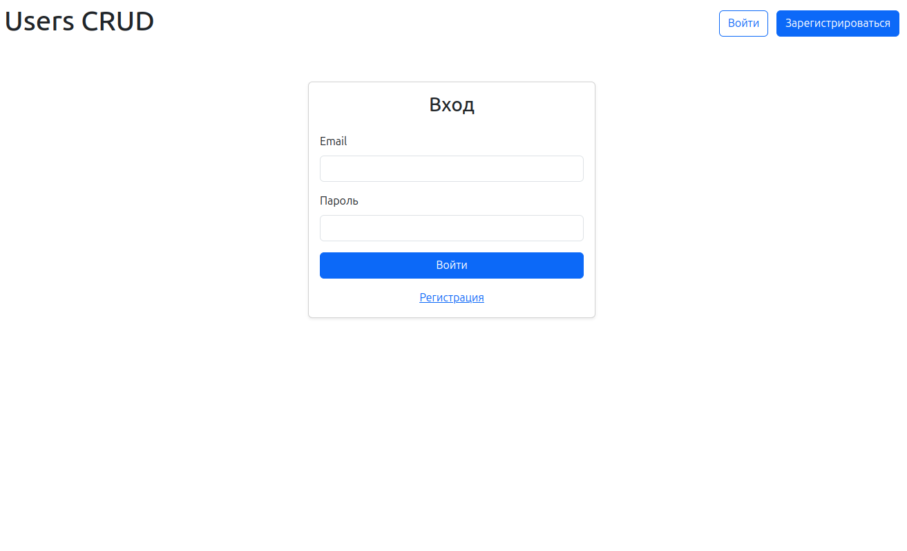
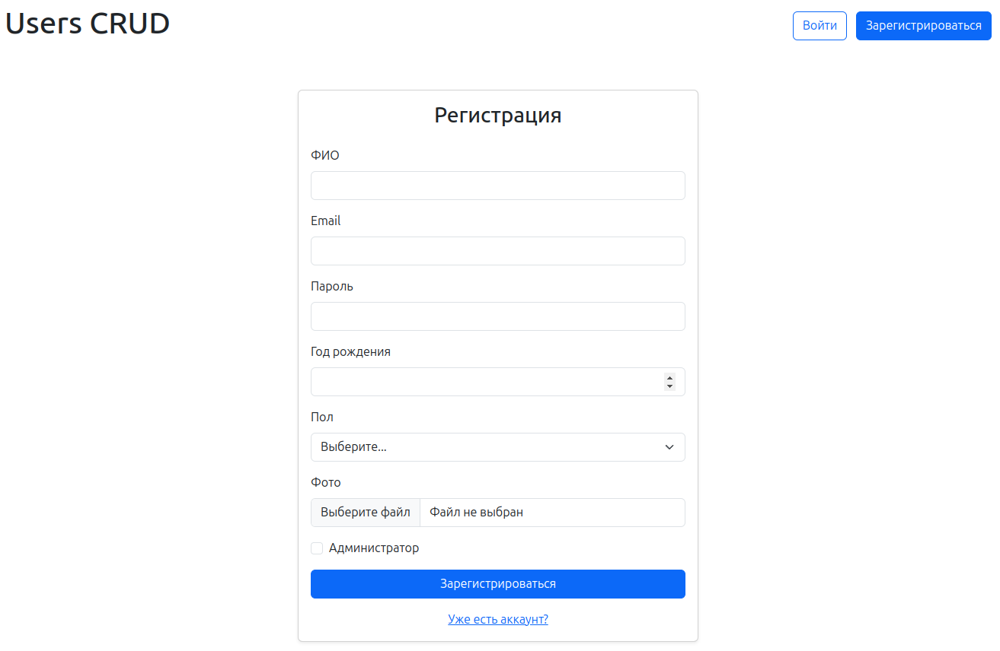
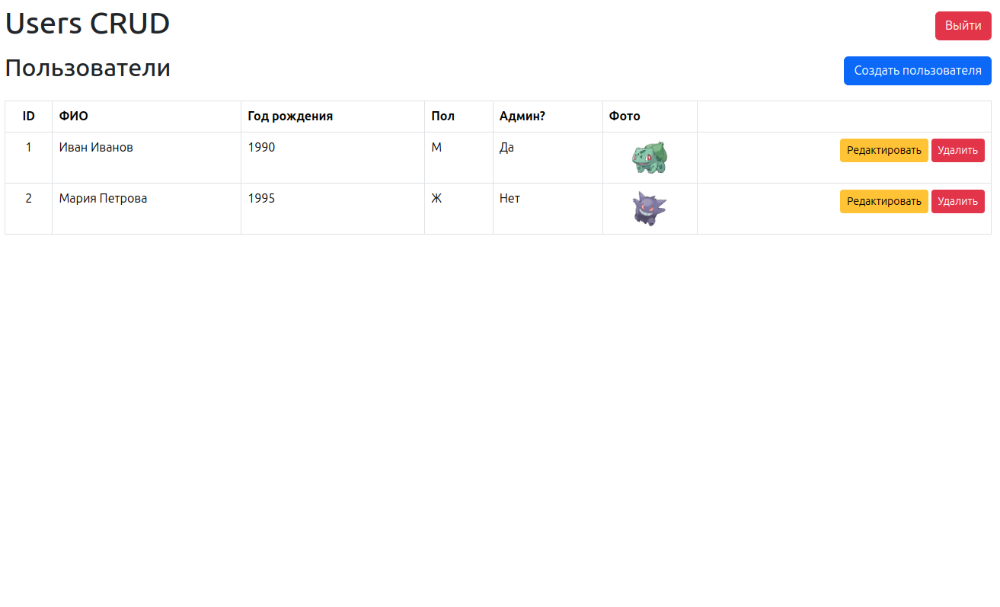
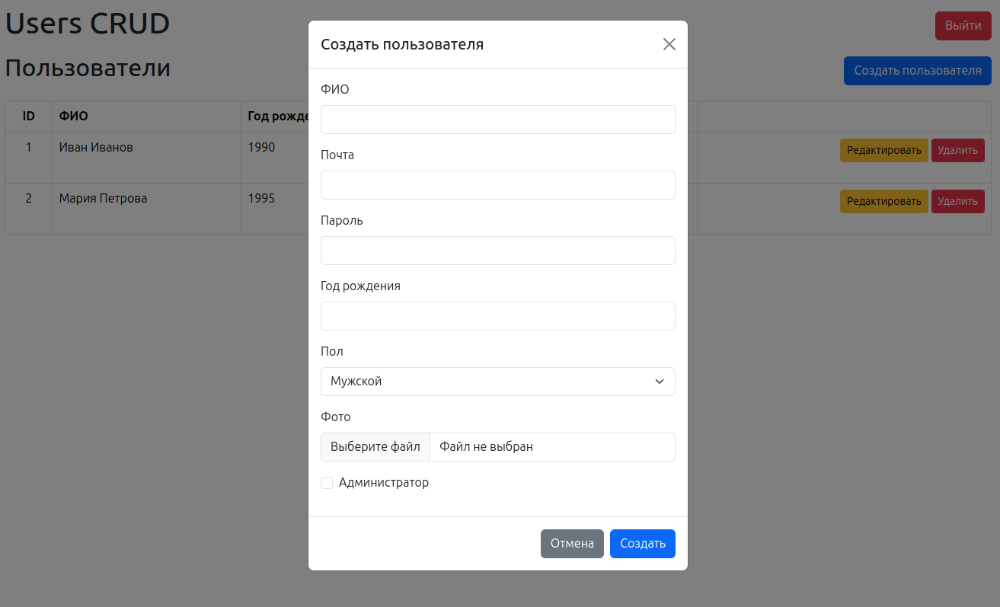
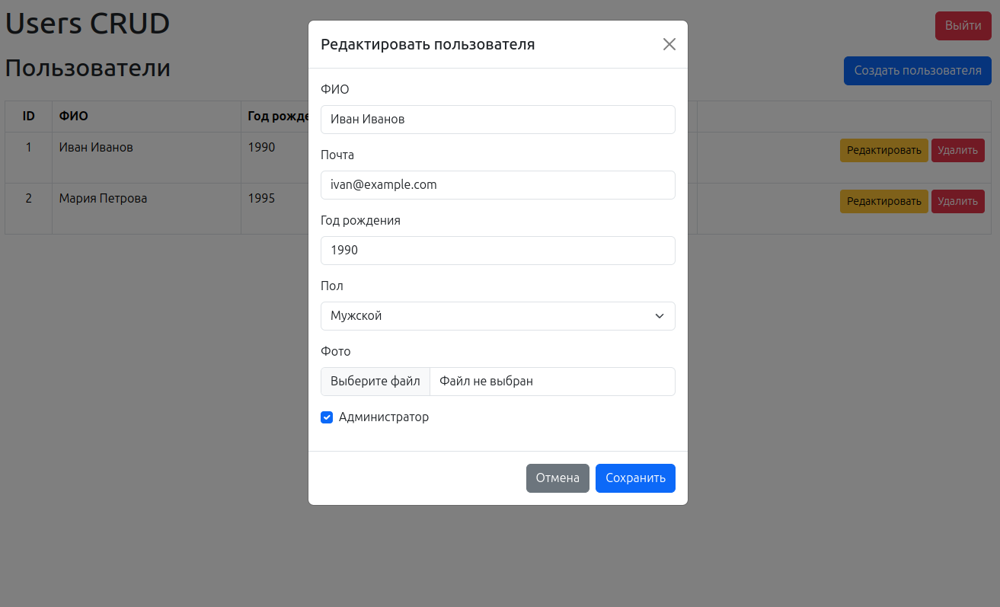

# 👤 Users CRUD — тестовое задание

## 📖 Описание
Простое веб-приложение для управления пользователями, реализованное **на чистом PHP без фреймворков**.  
Функционал:
- 🔑 Авторизация и регистрация
- 📋 Просмотр списка пользователей
- ➕ Создание нового пользователя
- ✏️ Редактирование существующего
- ❌ Удаление пользователей
- 👩🏻‍🦱 Загрузка аватаров

## 🖥️ Скриншоты

| Авторизация | Регистрация | Главная |
|-------------|-------------|---------|
|  |  |  |

| Создание пользователя | Редактирование |
|------------------------|----------------|
|  |  |

## 🚀 Установка и запуск

1. Клонируйте репозиторий:
   ```bash
   git clone https://github.com/infern397/users-crud.git
   cd users-crud
   ```
2. Создайте .env файл на основе .env.example:
   ```bash
   cp .env.example .env
   ```
3. Запустите Docker контейнеры:
   ```bash
   cd .docker
   ./up.sh
   ```
4. Перейдите в контейнер php:
   ```bash
    ./php.sh
   ```
5. Установите зависимости через Composer:
   ```bash
   composer install
   ```
6. Выполните миграции и сиды:
   ```bash
   cd bin
   php migrate.php
   php seed.php
   ```
7. Выдайте права на запись для папки `public`:
   ```bash
   cd ..
   chmod ugo+rw public
   ```
7. Выйдите из контейнера:
   ```bash
   exit
    ```

## 🌍 Доступ
- Приложение будет доступно по адресу:
👉 http://localhost:80
- PhpMyAdmin будет доступен по адресу:
👉 http://localhost:8080